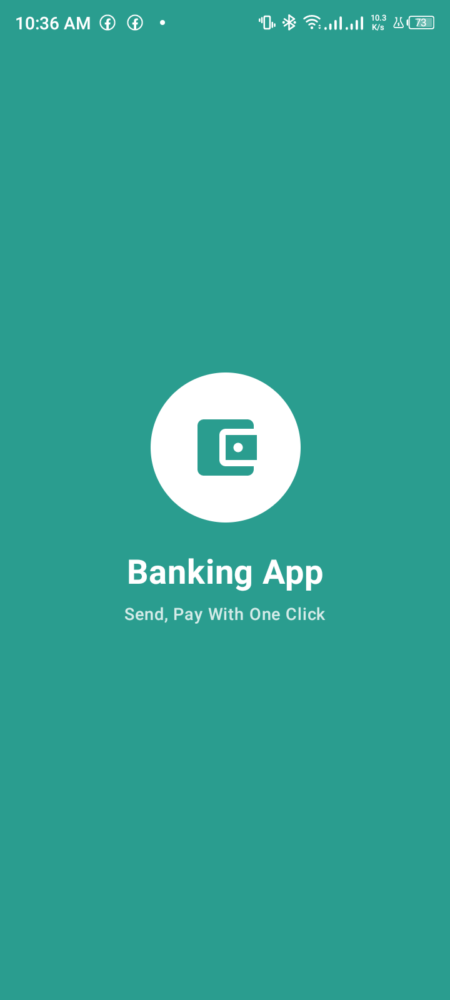
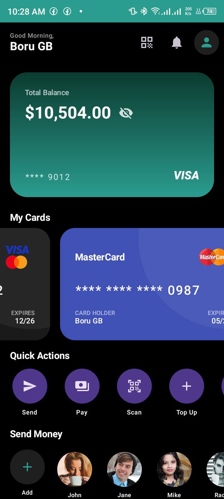
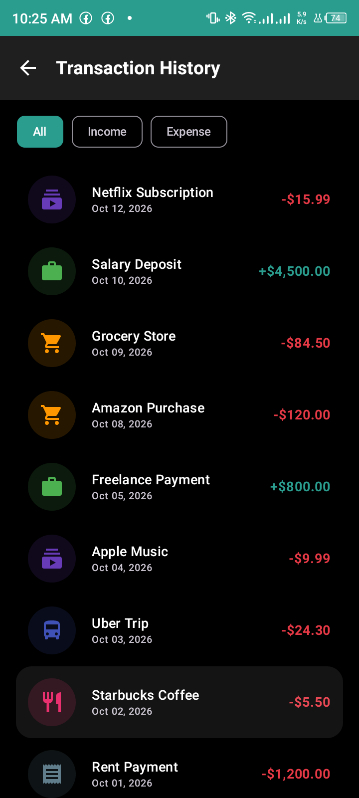
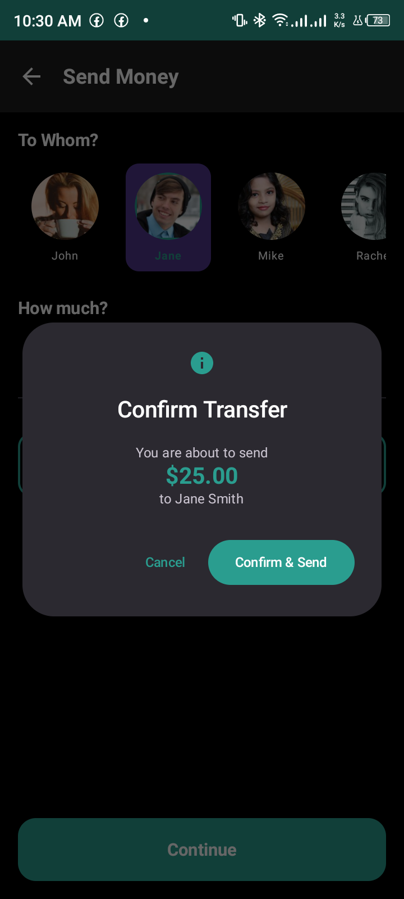
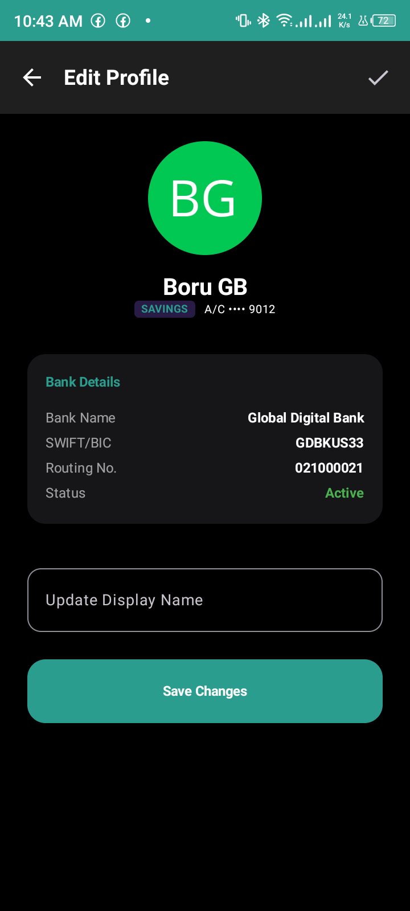

# 🏦 Banking App - Jetpack Compose

A high-performance, functional banking application built with a focus on reactive state management and secure peer-to-peer transfers.

## 📱 Screenshots

  
  
  

  
  

## ⚡ The "Magic QR" Protocol
This app implements a custom P2P protocol for secure offline-to-online payments:
1. **Locking**: The sender enters an amount; the app deducts and "locks" these funds in `WalletState`.
2. **Encoding**: Data is packed into a `MAGIC_PAY|SENDER_NAME|AMOUNT` string and rendered as a QR.
3. **Scanning**: The receiver uses the integrated ML Kit scanner to decode the payload.
4. **Settlement**: Funds are instantly credited to the receiver's balance, and a transaction log is generated for both parties.

## ✨ Key Features

- **Reactive Wallet State**: Centralized source of truth using `mutableStateOf` for instant UI updates across the entire app.
- **Privacy Mode**: One-tap toggle to mask sensitive balances and card details.
- **ML Kit Integration**: High-speed QR scanning with lifecycle-aware resource management.
- **Transaction Analytics**: Auto-categorization of spending (Subscriptions, Food, Work, etc.) with custom color-coded iconography.
- **Professional Bank Profile**: View full banking identity including SWIFT, Routing, and Account Status.

## 🛠️ Technical Highlights

- **State Management**: Singleton Pattern with global reactivity.
- **Threading**: Coroutine-based animations and simulated processing states.
- **Memory Optimization**: `DisposableEffect` used to prevent `ExecutorService` leaks in camera modules.
- **UI Architecture**: Modular component-based design for maximum reusability.

## 📦 Permissions Required
- `CAMERA`: For scanning Magic QR codes.
- `INTERNET`: For fetching dynamic profile avatars and future API integrations.

## 🏗️ Project Structure
- `data/`: Core logic, State Singletons, and Data Models.
- `screens/`: Compose UI for different app destinations.
- `components/`: Atomic UI widgets (Cards, Items, Buttons).
- `ui/theme/`: Material 3 design system implementation.

## 🚀 Getting Started
1. Clone the repository.
2. Open in **Android Studio Koala** or newer.
3. Ensure you have **JDK 17** configured.
4. Build and run on an Android device (API 24+).
